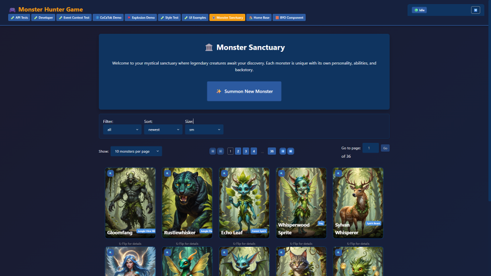

# LLM Monster Hunter Game  

  

*An AI-powered monster-catching adventure where every creature has a story to tell*  

  
  
  
  

---

## 🎮 **What is This?**  

At its heart, this is the archetypal fantasy adventure of capturing, training, and battling creatures. But here, every monster, every encounter, every outcome is generated in real time by AI. It’s an experiment in a new coding paradigm powered by AI where the code itself doesn’t define the gameplay—it only provides context management and data storage, while AI does the actual storytelling, balancing, and decision-making. 

Where traditional games spend compute on rendering high-fidelity graphics, this project spends compute on LLMs and image models. Where most games ship with gigabytes of pre-made game assets, here you download a model, and the monsters, visuals, personalities, and even battle outcomes are created as you play. 

This is a **personal project**, built solo for **educational purposes** and as part of my **portfolio**. If you’ve somehow found this repo—welcome! I even built an **interactive setup** to guide you through installation. That said, because of the number of dependencies (Python, Node, MySQL, CUDA, ComfyUI, etc.), even with the setup script it may still take a few hours to get running.  

---

## ✨ **Key Features**  

### 🤖 **AI-Powered Everything**  
- **Dynamic Monster Generation** – Every creature is created by an LLM with a unique persona, backstory, and abilities.
- **Evolving Conversations** – Monsters can only be captured if they choose to join you, after a post-battle chat where persuasion matters.
- **Emergent Storytelling** – The world runs on the idea that every monster has a wish, from reviving a loved one to seeking ultimate power. These desires shape dialogue, battles, and evolution paths.
- **AI-Generated Artwork** – ComfyUI generates unique art for every monster  
- **Text-Driven Battles** – Combat is turn-based but narrated by the LLM, with outcomes explained through vivid descriptions instead of raw numbers.
- **Monster Recruitment** – Victory in battle doesn’t guarantee capture; you’ll need to negotiate with monsters in conversation.
- **Dungeon Exploration** – Navigate through doors leading to traps, treasures, monsters, or story-driven campsite encounters.
- **Evolution System** – Monsters evolve not just in stats and visuals, but in memories, affinities, and personality, carrying their past experiences into the future.

---

## 🚧 **Development Status**  

We’re currently in the **early stages** of development. The focus so far has been on building infrastructure rather than gameplay. Here’s what’s working today:  

- ✅ **ComfyUI integration** for AI image generation  
- ✅ **AI queue system** to unify LLM and image generation requests  
- ✅ **Workflow queue system** capable of chaining multiple AI requests into structured game objects  
- ✅ **Monster generation**: create monsters with **names, personality traits, abilities, backstories, and unique images**, viewable in the frontend  

**Vision for the future:**  
- Enter dungeons and face procedurally generated encounters  
- Battle monsters in **state-driven, AI-mediated combat**  
- Befriend monsters through conversation  
- Evolve monsters and unlock new abilities  
- Eventually, **chat directly with your monsters** as companions  

  

---

## 🏗️ **Project Architecture**  

### Tech Stack  
- **Backend:** Python 3.9+, Flask 3.0, MySQL 8.0  
- **Frontend:** React 18+, HTML5, CSS3, JavaScript ES6+  
- **AI Integration:** llama-cpp-python, ComfyUI  
- **Development Tools:** Git, VS Code, npm/pip  

---

## 🚀 **Quick Start**  

### Prerequisites  
(You’ll need all of these installed before setup will work.)  

- Python 3.8+  
- Node.js 16+ (includes npm)  
- MySQL Server  
- NVIDIA GPU Drivers (latest)  
- CUDA Toolkit 12.x  
- Visual Studio Build Tools (with C++ components)  
- ComfyUI (installed separately)  

### Required Models  
- **Text Model:** 7B GGUF model (recommended: *kunoichi-7b*)  
- **Image Model:** SDXL Turbo (recommended: [DreamShaper XL Turbo](https://civitai.com/models/112902/dreamshaper-xl))  

### Starting the Game  

- Run **`start_game.bat`** to launch the game.  
  - This will guide you through the setup walkthrough.  
  - Make sure your **ComfyUI server is already running** before starting.  
  - After the first setup, you can use `start_game.bat` to start both the backend and frontend together.  
- Alternatively, you can run:  
  - **`start_backend.bat`** to only start the backend  
  - **`start_frontend.bat`** to only start the frontend  

⚡ *With everything installed, run the setup script. The game will be available at:*  
👉 `http://localhost:3000`  

---

## 🤝 **Contributing**  

This is mostly a solo learning project, but feedback and suggestions are welcome. If you’re trying to get it running yourself—good luck, and I’d love to hear about it.  

---

## 📄 **License**  

This project is licensed under the MIT License – see the [LICENSE](LICENSE) file for details.  

---

## 🙏 **Acknowledgments**  

- **Open Source Community** – Flask, React, llama.cpp, and countless others  
- **AI Research Community** – For advancing the tech that makes this experiment possible  

---

## **Contact**  

**Aaron Orelup**  
📞 Text: (510) 695-1134  

---

**Ready to catch some AI-generated monsters?** 🐉✨  