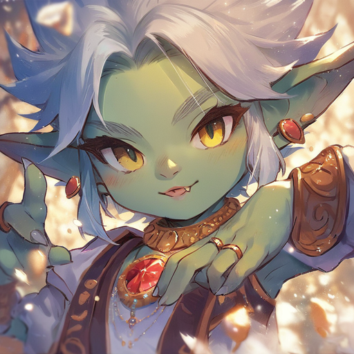
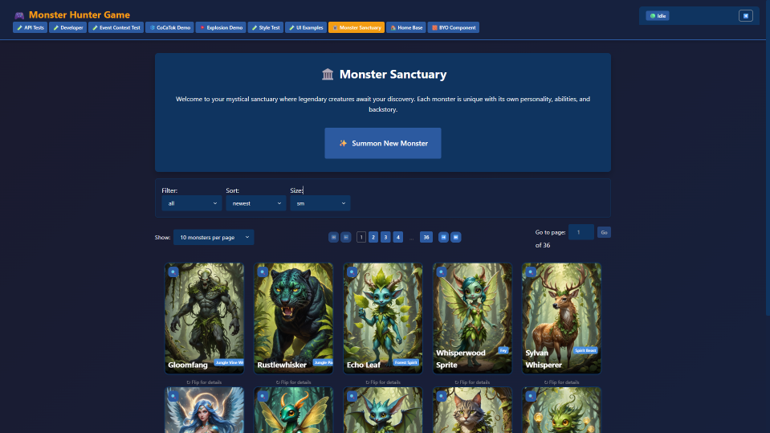

# LLM Monster Hunter Game

*An AI-powered monster-catching adventure where every creature has a story to tell*

---

## 🎮 **What is This?**

At its heart, this is the archetypal fantasy adventure of capturing, training, and battling creatures. But here, every monster, every encounter, every outcome is generated in real time by AI. It's an experiment in a new coding paradigm where the code itself doesn't define the gameplay — it only provides context management and data storage, while AI does the actual storytelling, balancing, and decision-making.

Where traditional games spend compute on rendering high-fidelity graphics, this project spends compute on LLMs and image models. Where most games ship with gigabytes of pre-made assets, here you bring two API keys, and the monsters, visuals, personalities, and even battle outcomes are created as you play.

This is the **API-first** edition of the project: text generation runs on 1M-token-context cloud models (DeepSeek) and card art on the Gemini image API — a sibling repository, [LlmMonsterHunter-Local](https://github.com/Bloodtailor/LlmMonsterHunter-Local), explores the opposite bet: redesigning the game around small local models.

This is a **personal project**, built solo for **educational purposes** and as part of my **portfolio**. If you've somehow found this repo — welcome! Setup is one double-click: the launcher installs what it can by itself and walks you through the rest — no GPU, no CUDA, no local models, no terminal skills needed. You bring two API keys (well, one — the art key is optional).

---

## ✨ **Key Features**

- **Dynamic Monster Generation** — every creature is created by an LLM with a unique persona, taxonomy, backstory, and abilities, plus Gemini-painted card art; evolution repaints use the old art as a **reference image**, so a transformed monster stays recognizably itself
- **Text-Driven, LLM-Refereed Battles** — turn-based combat narrated by the LLM; monster wellbeing and stamina/mana are positions on *word ladders*, never HP math. Attack, defend, use abilities, or **type your own free-text action** — the referee decides if it's possible
- **Battlefield Negotiation & Recruitment** — monsters join only by their own will; bargain, threaten, or plead mid-battle, and enemies can talk, plead, or flee on their own turns too
- **Dungeon Exploration** — choose between mysterious paths that each secretly hold an event: explorable locations, riddle-posing monsters, battles, treasure, or a face from a previous run
- **Persistent Monster Memories** — monsters remember battles, conversations, defeats, and journeys across runs; defeated monsters can **return changed** — hostile, friendly, or wary
- **Growth & Evolution** — small journal-earned growth during runs, and a transformative home-base **Evolution Altar** ceremony: new form, new art, evolved persona — same monster, same memories
- **Campfire Chat** — open-ended home-base conversations with your monsters, with memory extraction and rolling summaries so chats can run indefinitely
- **Items & CoCaToks** — LLM-adjudicated consumables found in dungeons, gifted in dialogue, or earned as victory keepsakes
- **Real-Time Everything** — LLM tokens and domain events stream over SSE, so the UI updates the moment each datum exists (live card reveals, streaming narration)

---

## 🚧 **Development Status**

All core mechanics are implemented and playable. Each initiative below has a full plan doc in [docs/plans/](docs/plans/):

| Initiative | What shipped |
|---|---|
| Core loop | Monster generation, dungeon paths, riddle encounters, LLM-refereed battles, battlefield recruitment |
| [Monster depth + inventory](docs/plans/monster-depth-cmdts.md) | Persona/taxonomy depth (CMDTS), items, CoCaToks, pickup ceremonies |
| [Memories & growth](docs/plans/monster-memory-evolution.md) | Cross-run memories, returning monsters, growth reflections, stamina/mana ladders |
| [Campfire Chat](docs/plans/monster-chat.md) | Home-base conversations, memory extraction, rolling summaries for all logs |
| [Evolution Altar](docs/plans/monster-evolution.md) | Transformative evolution with lineage, art regen, evolved personas |
| [Game Loop v1](docs/plans/game-loop-v1.md) | Title screen, guided first run, expedition notices + danger, run goals + stakes, affinity + wary autonomy, post-run chronicle |
| [New Game & player character](docs/plans/new-game-experience.md) | New Game world wipe, character-creation wizard with portrait, player always in the party, chat-as-player |
| [Settings + DeepSeek](docs/plans/game-settings.md) | In-game settings panel, DeepSeek cloud provider with live model discovery and exact token usage |
| [Cloud generation](docs/plans/cloud-generation.md) | 1M-token context floor (absolute token caps, 70% ceiling), ComfyUI → Gemini image API, reference-image evolution repaints, Images settings section |

**What's next:** living on the cloud stack — tuning prompt budgets and art style in real play — alongside a [codebase health pass](docs/plans/codebase-health.md) (retiring the file-size grandfather list, consolidating the dev/demo surfaces). The gameplay direction after that is sketched in the [roadmap](docs/roadmap.md): monster requests, nemesis arcs, party bonds, regions.

---

## 🏗️ **Architecture**

The short version: a strictly-layered Flask backend orchestrates a text LLM (DeepSeek, or a local GGUF as an unsupported escape hatch) and the Gemini image API through **one gateway and two queues**, streams tokens and domain events to React over **SSE**, and follows one philosophy everywhere: **the LLM only ever picks words — Python owns every number.**

- Expensive actions queue a **workflow** and return immediately; results stream over SSE
- Combat uses **word ladders** (`fresh → … → incapacitated`), not HP math
- Prompt blocks carry **absolute token caps** under a 70%-of-window ceiling (the supported floor is a 1M-token context window); old history is condensed by rolling summaries
- Every AI request is logged byte-exact and inspectable in the in-app developer tools

Read the full tour in [docs/architecture.md](docs/architecture.md), tweak anything via [docs/tuning.md](docs/tuning.md), and see the API in [docs/api/](docs/api/README.md).

### Tech Stack
- **Backend:** Python 3.9+, Flask 3.0, MySQL 8.0, SQLAlchemy
- **Frontend:** React 18 (CRA), custom component library, SSE
- **AI:** DeepSeek API (text, 1M context), Gemini image API ("Nano Banana 2" card art); llama-cpp-python remains as an unsupported local escape hatch

---

## 🚀 **Quick Start**

You don't need to be technical — if you can install a program, you can run this. Windows 10/11:

1. **Download the game** — click the green **Code** button at the top of this page, choose **Download ZIP**, and unzip it anywhere (right-click → Extract All).
2. **Double-click `start_game.bat`** inside the unzipped folder. The first run sets everything up: it offers to install the free software the game is built on (Python, Node.js), and walks you through the one step that needs you — installing MySQL, the free database that stores your monsters. Just follow what the window says; if it asks you to close it and double-click again, that's normal. After the first time, the same double-click simply starts the game.
3. **Paste in your API key.** When the game opens in your browser (at `http://localhost:3000`), click the **⚙️ gear icon** and paste a [DeepSeek](https://platform.deepseek.com/) API key — that powers all the story text. Card art is optional: add a [Google Gemini](https://aistudio.google.com/) key whenever you like; the game plays fully art-less without one.

**What it costs:** the AI usage is pay-as-you-go — card art runs ~$0.07 per image on the default model (Nano Banana 2), so a heavy session is a dollar or two in images plus pennies of DeepSeek text. No subscription.

**What you do NOT need:** no GPU, no CUDA, no local models, no gigabytes of downloads — the AI runs in the cloud.

### For Developers

- Start pieces individually: **`start_backend.bat`** / **`start_frontend.bat`**
- Offline test suites (LLM stubbed, dedicated test DB): `python -m pytest` or the in-app Developer screen
- Every gameplay knob is cataloged in [docs/tuning.md](docs/tuning.md)
- Working with an AI assistant? Conventions live in [CLAUDE.md](CLAUDE.md)
- *The unsupported local escape hatch* (an NVIDIA GPU, CUDA 12.x, Visual Studio Build Tools, and a ≥1M-context GGUF model) is reachable via `python -m setup.setup_environment --local-extras` — it no longer appears in the normal setup at all, and the game no longer supports models with smaller context windows.

---

## 🤝 **Contributing**

This is mostly a solo learning project, but feedback and suggestions are welcome. If you're trying to get it running yourself — good luck, and I'd love to hear about it.

---

## 📄 **License**

This project is licensed under the MIT License – see the [LICENSE](LICENSE) file for details.

---

## 🙏 **Acknowledgments**

- **Open Source Community** – Flask, React, llama.cpp, and countless others
- **AI Research Community** – for advancing the tech that makes this experiment possible

---

## **Contact**

**Aaron Orelup** — [github.com/Bloodtailor](https://github.com/Bloodtailor)

---

**Ready to catch some AI-generated monsters?** 🐉✨
