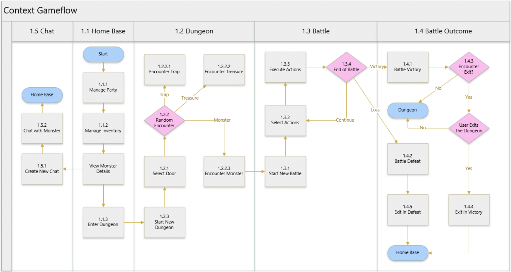

# Gameplay Design

**Date:** February 28, 2025  
**Document Type:** Design Phase Deliverable

## Gameplay Introduction

### Overview
- **Goal:** Create a video game that uses Large Language Models (LLMs) as a core part of gameplay
- **Type:** Monster catcher game
- **Gameplay:** Capture, raise, and battle monsters in dungeons
- **Design:** Text-based with a visually appealing UI, no animations

### Key Features

#### 1. Monster Generation
- Every single monster is created from scratch by an LLM
- All monsters include a persona, a backstory, abilities, and stats
- An image generating model creates images for each monster

#### 2. Monster Evolution
- Monsters gain new abilities depending on their activities in battle and conversations with the player
- Monsters can be evolved to receive new names, stats, and attributes, all generated by the LLM
- New images are generated for evolved monsters

#### 3. Monster Battle
- As players navigate through dungeons, they encounter monsters
- Player commands for each monster are processed by the LLM to evaluate the outcomes of each attack
- Monsters captured in battle can be used in future dungeon runs

#### 4. Monster Chat
- Each monster has a roleplaying chatbot that the player can talk with
- Conversations are saved and impact how the monster behaves in battle and evolve
- Monsters can only be captured by their own will. Players will need to convince them to join their crew

## High-Level Game Concept

This game is a monster-catching RPG that brings strategy and surprise to every step of the journey. The world is teeming with creatures—ranging from mythical beings and legendary beasts to quirky creatures and fantastical hybrids. Each monster you encounter is uniquely crafted, with its own personality, motivations, and abilities that make every encounter feel fresh and exciting.

Battles are the heart of the experience, with each monster wielding abilities that reflect its individuality. Whether they're fierce warriors, cunning tricksters, or cautious supporters, their skills evolve dynamically based on their nature and the events they experience. The monsters you meet are not just obstacles or allies—they are part of a living, unpredictable world that feels endlessly rich and varied.

Your choices will shape your adventure, but so will the monsters' personalities, actions, and even their quirks. Each dungeon run is a chance to strategize, face unexpected challenges, and uncover the endless variety of creatures that inhabit this ever-changing world.

### Core Features

#### Turn-Based Strategic Battles
Battles are fast-paced, turn-based, and packed with depth. Monsters bring their unique abilities into every fight, challenging you to adapt your strategy. A tricky goblin might use underhanded tactics to confuse your team, while his shy brother might quietly heal their allies from the sidelines. Success requires understanding each monster's strengths, weaknesses, and personality-driven fighting styles.

#### Living, Breathing Monsters
Every monster is a fully realized character, not just a set of stats. They come with their own histories, motivations, and preferences. Chat with them, earn their trust, and watch as they grow—not just in power but in personality. They might even surprise you with their own choices, desires, and paths to evolution.

#### Emergent Stories
This game doesn't tell you a story; it helps you live one. Monsters are not just mobs to kill and capture, you can talk with them in your own voice to learn who they are, their dreams, their regrets. Narrative emerges from the interplay of your choices, the monsters' agency, and the serendipitous encounters that define your adventure. Your dungeon dives aren't just missions—they're chapters in a tale that could only happen to you.

## Game Flow

### 1.1 Preparation Phase – Home Base
The Home Base serves as the player's hub, where preparation and strategy are essential before embarking on a dungeon run.

#### 1.1.1 Party Management
Players begin by organizing their active party from their roster of captured monsters. They can:
- View and search through all of their Captured Monsters
- Move Monsters to and from their Active Party

#### 1.1.2 Inventory Management
Players are able to store as many items as they wish at home base, but can only bring a few items with them as they enter a new dungeon. They must decide which items to bring with them and which to leave. They can:
- View and search through their Home Base Inventory
- Add or remove items from their Personal Inventory
- View item details

#### 1.1.3 Enter Dungeon
With their party and items prepared, players transition to the dungeon, starting their journey of discovery and challenge.

#### 1.1.4 Monster Details
At the Home Base, Players are invited to take their time to get to know their Monsters in more detail. They can:
- Select and review detailed monster stats, including unique abilities, traits, and titles
- Rename monsters to add personal significance to the roster
- View in full screen the Monster Card Art
- View any other relevant details specific to the Monster
- Enter into a chat with their Monsters to get to know their personality

### 1.2 Exploration Phase – Dungeon
Inside dungeons, players will encounter monsters, traps, and treasures for the main goal of capturing and leveling monsters. Once inside, they can only leave with their monsters and treasure if they can find an exit. Otherwise, if they fail to find an exit and are defeated in the dungeon, they will lose all items and monsters they have collected inside.

#### 1.2.1 Choosing Doors
Players are presented a choice between three doors, each with a thematic name. It is unknown to them where each door may lead, whether it be a trap, treasure, or monster encounter.

#### 1.2.2 Encounters
Once a player chooses a door, they will encounter one of the following:

**Traps:** Players are presented with a challenge. If they fail, they will suffer a consequence.

**Treasures:** Players are given a reward.

**Monsters:** Transition to the Battle Screen when monsters are encountered.

#### 1.2.3 Start New Dungeon
When Starting a new Dungeon, players are provided a story transition to set the mood of the adventure.

### 1.3 Combat Phase – Battles
The battle phase is a turn based system of strategic decision-making, emphasizing perception, creativity, and adaptation.

#### 1.3.1 Start New Battle
Players are introduced to enemy monsters, with text descriptions and, occasionally, dialogues adding personality and stakes to the encounter.

#### 1.3.2 Select Monster Actions
Players select an action for each monster in their party:
- **Attack** (a basic attack to deal damage to an enemy)
- **Use an ability** (if required, player will select the Target(s))
- **Evade** (Increase the ability to dodge Offensive Abilities for 1 turn)
- **Stand By** (Increases Recharge Rates of Consumable Attributes)

Actions are confirmed and queued by clicking "Execute."

#### 1.3.3 Execute Actions
Each queued action is executed sequentially, reflected step-by-step in the Battle Log. The player clicks "Next" to resolve each action in turn.

If an action meets conditions to end the battle, the remaining actions are skipped, and the game transitions to the Post-Battle Phase.

#### 1.3.4 Determine Round Outcome
- The battle is a **Victory** if all Enemies are Defeated
- The battle is a **Defeat** if all Allies are Defeated
- If all actions are executed without ending the battle, the game loops back to the Action Selection phase for the next round

### 1.4 Post-Battle Phase

#### 1.4.1 Battle Victory
Upon defeating all enemies, players experience celebratory text describing the victory and the aftermath. Possible Rewards include:
- New Items or Abilities for Monsters
- New Titles that enhance Monster Stats or Abilities
- Opportunities to attempt Recruiting a defeated enemy Monster
- A chance to Encounter an Exit

#### 1.4.2 Battle Defeat
If all party monsters are defeated, the player experiences a descriptive text detailing the circumstances of the loss and leaves the dungeon with an Exit in Defeat.

#### 1.4.3 Encounter Exit
Players must make an immediate choice to either Exit the Dungeon with an Exit in Victory or to forgo this opportunity and continue adventuring in the Dungeon.

#### 1.4.4 Exit in Victory
Players return to Home Base retaining the rewards of their dungeon run. Possible Rewards include:
- Adding newly captured monsters to the home base roster
- Consolidating inventory, moving collected items to the Home Base
- Leveling up Monsters and gaining new Abilities
- Gaining new Titles for the Monsters and Evolving the Monsters
- Finalizing the dungeon run with a summary of its highlights

#### 1.4.5 Exit in Defeat
Following a defeat, players are returned to the Home Base with penalties, including:
- Loss of captured monsters and items collected during the dungeon run
- Retaining only experience gained and rare abilities or titles earned in battle

### 1.5 Social Phase – Monster Chats
Between dungeon runs, players can engage with their captured monsters in a conversational format. Monsters have backstories, motivations and wants that can only be discovered through conversations.

#### 1.5.1 Start New Chat
- Create a new chat with one of the Monsters
- Display Monster's introduction message

#### 1.5.2 Chat with Monster
- Allow Users to chat with Monster in conversation
- Display Monster response

## Core Mechanics

### Combat
Players will have a number of monsters on their party (around 4). The enemy team will also have a number of monsters (around 1-7). Each round, the player selects actions for each monster on their party and selects a target if required. For further control, players may add additional information as text. The LLM will also do the same for the enemy party. Once the player is satisfied with their selection, they will click a button to initiate battle processing. Once battle processing starts, the player cannot make any impact on the actions. The LLM will generate text describing how each action plays out and the effects that occur. The player will click through these descriptions until the processing is finished. The LLM will then decide the outcome of the round, whether it is defeat, success or unresolved. If unresolved, a new round will start. Monsters who are incapacitated will not be able to participate in the round. All processing will be done through text by the LLM. Numbers may be used, but only to describe magnitude, not for explicit math.

### Capture
Monsters can only be captured if the monster agrees to it. This process starts after the player successfully wins a battle against a group of monsters. The player then can select one monster to attempt to recruit. They will start a chatbot dialog and be given a maximum number of messages that they may send to convince the monster to join the player's party. The monster may choose not to join, in which case, the player does not gain a monster to their party. If the monster chooses to join, they will have a starting affinity to the player depending on how this conversation went. This affinity will affect many aspects of gameplay including how likely the monster obeys the command given to it by the player. This affinity will change as the game progresses.

### Monster Chat at Home Base
Players may chat with any of their captured monsters at their home base. The player may talk about anything with the monster and for as long as they want. There will be key aspects of the monster's background, motivations, wants, and dislikes that can be discovered through conversation. Each conversation will have a permanent effect on the monster's affinity depending on the interaction. An abridged version of the conversation will be saved to the monster's memory.

### Memories
Monsters will have various memories that they develop throughout the game. It will create memories on what abilities it has used, what monsters it has been hurt by, and what monsters it has been helped by. Memories will also be generated when the monster is captured and when the player chats with the monster. These memories will be used every time the LLM is used to generate for that specific monster. This includes battles, dialog, chats, acquiring abilities, and evolution.

### Acquiring Abilities
Monsters gain experience after every successful battle. The amount awarded will be determined by the LLM. Once the monster has enough experience, the creature levels up. Every time the creature levels up, it has a percent chance to acquire a new ability. New abilities are created by the LLM and take into account the monster's memories. New abilities may also be granted in other ways such as items or events. There is no limit to the number or types of abilities that a monster may have.

### Evolution
Monster's may be evolved at the home base when given an evolve fruit which is earned after the successful completion of a dungeon. When a monster is created, they are given an evolution path. Not all monsters have an evolution path, and some have longer evolution paths than others. A monster may only be evolved if they have an evolution on their evolution path that has not already been obtained. Upon evolving, the monster will receive new stats, new card art, their persona will be updated and all of their abilities will be regenerated.

### Camp Sites
Inside the dungeon, players may open a door that leads to a campsite which is a narrative encounter. An LLM will generate dialog between the monsters as they roleplay relaxing at the campsite before eating dinner and going to bed. This encounter is solely narrative and may be skipped. The point of this encounter is to let the player experience genuine interactions between their monsters so that they can get to know their monsters' personalities a little better.

### Monster Battle Intros
When a player encounters a group of monsters in the dungeon, monsters will give battle encounter dialog. This dialog will be unique to each monster and take into account their character and backstory. For example, the monster Rokk whose background is that he was born in the deep caves of the mountain realm. After his colony was destroyed by an earthquake, Rokk wandered into the outside world, seeking new allies and a new home. His encounter dialog might be "Intruder detected. Prepare to be crushed under the weight of the mountain!"

### Monster Reactions
Monster's will give reactions to various things that happen in the game. For example, giving an item to a monster will elicit a reaction. These reactions will take into account the monster's persona, backstory, and memories and will be generated by an LLM to give life to the character. Other interactions that will elicit a reaction are winning/losing in battle, acquiring new abilities, and entering a door in the dungeon. Some interactions that elicit reactions like entering a door, The LLM will decide if a reaction should be elicited and which monster should have the reaction. The purpose is to make sure that the reactions do not feel forced or repetitive. It should feel spontaneous and warranted.

---

**Related Documents:**
- [Story Design](story_design.md)
- [UI Design](ui_design.md)
- [Use Cases](../use_cases/use_cases.md)